<p align="center">
  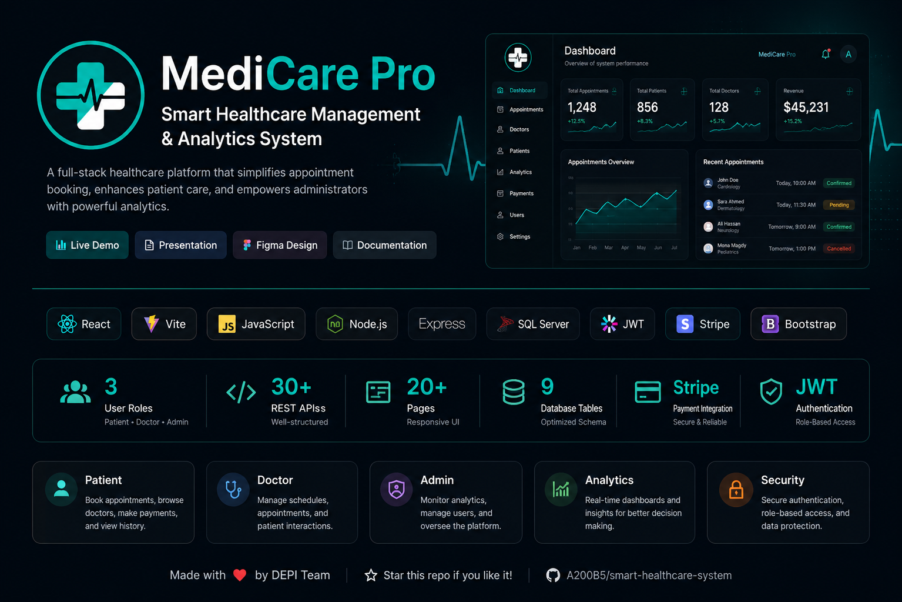
</p>

<br>

<p align="center">
  
</p>

<h1 align="center">
Smart Healthcare Management & Analytics System
</h1>

<p align="center">
<b>MediCare Pro</b><br>
A Modern Full-Stack Healthcare Platform for Patients, Doctors, and Administrators.
</p>

---

<p align="center">


</p>

---

<p align="center">

<a href="YOUR_DEMO_LINK">

</a>

<a href="YOUR_PRESENTATION_LINK">

</a>

<a href="YOUR_FIGMA_LINK">

</a>

</p>

---

#  About MediCare Pro

**MediCare Pro** is a production-style **Full-Stack Healthcare Management Platform** designed to modernize the healthcare appointment lifecycle through secure authentication, online payments, intelligent scheduling, and role-based dashboards.

The platform connects **Patients**, **Doctors**, and **Administrators** within one unified ecosystem, allowing users to efficiently manage appointments, payments, reviews, doctor availability, analytics, and administrative operations.

Unlike traditional academic projects, MediCare Pro follows modern software engineering practices by implementing a scalable architecture, reusable frontend components, secure REST APIs, JWT authentication, Stripe payment integration, automatic refund workflows, analytics dashboards, and role-based access control.

This project was developed as part of the **Digital Egypt Pioneers Initiative (DEPI)** and aims to demonstrate real-world enterprise application development using modern web technologies.

---

# 🌟 Why MediCare Pro?

Healthcare systems require more than simply booking appointments.

MediCare Pro provides an integrated healthcare ecosystem that focuses on:

- Secure authentication using JWT
- Intelligent appointment scheduling
- Online payment processing using Stripe
- Automatic refund workflows
- Doctor availability management
- Analytics & revenue dashboards
- Responsive user experience
- Role-based authorization
- Modern dashboard interfaces
- Production-ready backend architecture

The project was designed with scalability, maintainability, and user experience as its primary objectives.

---

# 📊 Project Statistics

<p align="center">

| Metric | Value |
|:-------|------:|
| 👥 User Roles | **3** |
| 📄 Application Pages | **27** |
| 🔌 REST APIs | **34 APIs** |
| ⚡ API Endpoints | **41 Endpoints** |
| 🗄 Database Tables | **7** |
| 💳 Payment Gateway | **Stripe** |
| 🔐 Authentication | **JWT** |
| 📱 Responsive Design | ✅ |
| 📈 Analytics Dashboard | ✅ |
| 💰 Revenue Dashboard | ✅ |

</p>

---

# ⚡ Quick Navigation

- [✨ Features](#-features)
- [🛠 Tech Stack](#-technology-stack)
- [🏗 System Architecture](#-system-architecture)
- [🗄 Database Design](#-database-design)
- [🔌 API Overview](#-rest-api-overview)
- [📂 Project Structure](#-project-structure)
- [🖼 User Interface](#-user-interface-showcase)
- [🚀 Installation](#-getting-started)
- [🔐 Security](#-security-features)
- [👥 Team](#-team-contributions)
- [🔮 Future Enhancements](#-future-enhancements)
- [📜 License](#-license)

---

# ✨ Features

MediCare Pro provides a complete healthcare ecosystem designed to simplify medical appointment management while ensuring security, scalability, and an exceptional user experience.

---

## 👤 Patient Portal

Patients can seamlessly manage every aspect of their healthcare journey.

<table>
<tr>
<td width="50%">

### 🔎 Find Doctors

- Search doctors by specialty
- View doctor profiles
- Browse ratings & reviews
- View available schedules

</td>

<td width="50%">

### 📅 Appointment Booking

- Book appointments instantly
- Real-time availability
- Conflict prevention
- Appointment history

</td>
</tr>

<tr>
<td>

### 💳 Payments

- Secure Stripe Checkout
- Online payments
- Automatic refunds
- Payment history

</td>

<td>

### ⭐ Reviews

- Rate doctors
- Write reviews
- View previous feedback

</td>
</tr>

<tr>
<td>

### 👤 Profile

- Update personal information
- Change password
- Manage account

</td>

<td>

### 🔔 Smart Experience

- Toast notifications
- Responsive interface
- Smooth booking workflow

</td>
</tr>

</table>

---

# 🩺 Doctor Portal

Doctors have complete control over appointments and schedules.

<table>

<tr>

<td width="50%">

### 📊 Dashboard

- Statistics
- Upcoming appointments
- Quick overview

</td>

<td width="50%">

### 📆 Schedule Management

- Weekly schedule
- Availability slots
- Working hours

</td>

</tr>

<tr>

<td>

### 📋 Appointment Requests

- Confirm appointments
- Complete appointments
- View patient details

</td>

<td>

### 👨‍⚕️ Profile

- Professional profile
- License information
- Contact information

</td>

</tr>

</table>

---

# 👨‍💼 Admin Portal

The administrator manages the entire healthcare platform.

<table>

<tr>

<td width="50%">

### 👥 User Management

- Patients
- Doctors
- Administrators

</td>

<td width="50%">

### 🩺 Doctor Management

- Doctor approval
- Doctor verification
- Manage doctors

</td>

</tr>

<tr>

<td>

### 📅 Appointment Management

- View all appointments
- Automatic refund workflow
- Soft delete strategy

</td>

<td>

### 📈 Analytics

- Revenue dashboard
- System statistics
- Doctor analytics
- Payment insights

</td>

</tr>

</table>

---

# 🛠️ Technology Stack

<table>

<tr>

<th>Frontend</th>
<th>Backend</th>
<th>Database</th>
<th>Payments</th>

</tr>

<tr>

<td>

- React
- Vite
- CSS3
- React Router
- Axios
- Context API

</td>

<td>

- Node.js
- Express.js
- REST APIs
- JWT
- Bcrypt

</td>

<td>

- SQL Server
- Stored Procedures
- Views
- Constraints
- Transactions

</td>

<td>

- Stripe Checkout
- Refund API
- Webhooks

</td>

</tr>

</table>

---

# 🏗️ System Architecture

<p align="center">

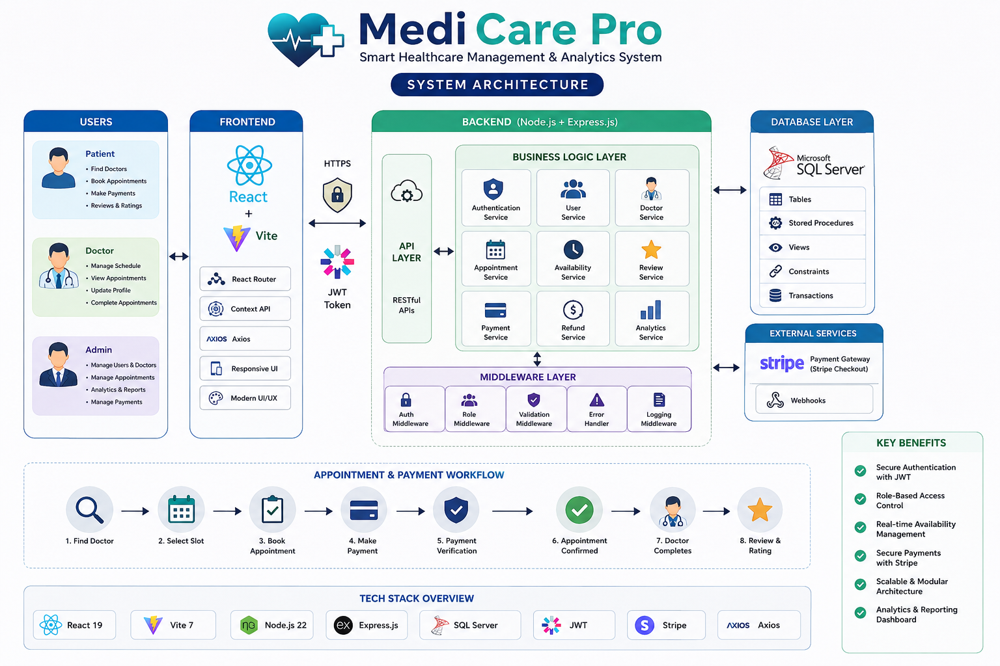

</p>

---

## 📖 Architecture Overview

The application follows a modern three-tier architecture that separates the presentation layer, business logic, and data layer.

```
                Patient
                 Doctor
                 Admin
                    │
                    ▼
          React + Vite Frontend
                    │
             Axios + JWT Token
                    │
                    ▼
          Express.js REST API
                    │
        ┌───────────┼───────────┐
        │           │           │
 Authentication   Business   Payments
    Services      Logic      Services
        │           │           │
        └───────────┼───────────┘
                    │
                    ▼
          SQL Server Database
                    │
         Stored Procedures
              Constraints
               Views
                    │
                    ▼
          Stripe Payment Gateway
```

---

# 🔄 System Workflow

```text
Patient Registration
        │
        ▼
Login (JWT Authentication)
        │
        ▼
Find Doctor
        │
        ▼
Book Appointment
        │
        ▼
Availability Validation
        │
        ▼
Stripe Checkout
        │
        ▼
Payment Verification
        │
        ▼
Appointment Confirmation
        │
        ▼
Doctor Completes Appointment
        │
        ▼
Patient Leaves Review
```

---

# 🚀 Core Project Highlights

<table>

<tr>

<td>🔐 JWT Authentication</td>

<td>💳 Stripe Integration</td>

<td>📈 Analytics Dashboard</td>

</tr>

<tr>

<td>🛡️ Role-Based Access</td>

<td>♻️ Automatic Refunds</td>

<td>📅 Smart Scheduling</td>

</tr>

<tr>

<td>🚫 Conflict Prevention</td>

<td>📱 Responsive Design</td>

<td>⚡ RESTful APIs</td>

</tr>

</table>

---

# 🗄 Database Design

The application relies on a relational SQL Server database carefully designed to ensure data consistency, integrity, scalability, and performance.

---

<p align="center">

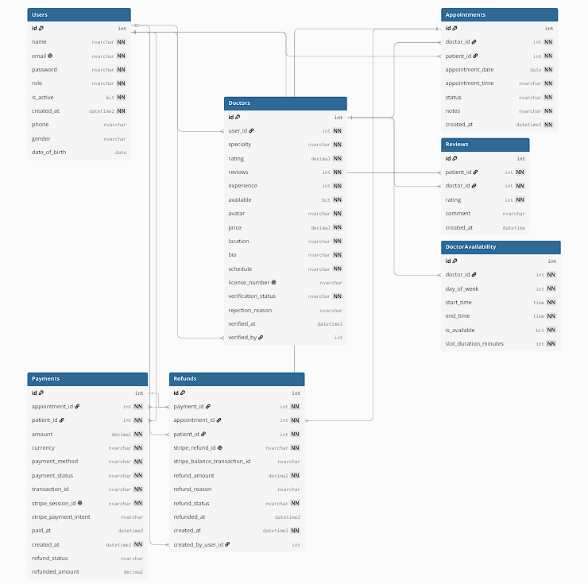

</p>

---

## 📋 Database Overview

| Table | Description |
|---------|-------------|
| Users | Stores authentication and account information for all users |
| Patients | Patient-specific information |
| Doctors | Professional doctor information |
| Appointments | Appointment scheduling and lifecycle |
| Payments | Stripe payment records |
| Reviews | Patient feedback and doctor ratings |
| DoctorAvailability | Doctor schedules and available time slots |

---

## 🔗 Database Relationships

- One User → One Patient
- One User → One Doctor
- One Doctor → Many Appointments
- One Patient → Many Appointments
- One Appointment → One Payment
- One Appointment → One Review
- One Doctor → Many Availability Slots

---

## ⚡ Database Features

- SQL Server
- Foreign Keys
- Check Constraints
- Transactions
- Stored Procedures
- SQL Views
- Optimized Queries
- Automatic Data Validation

---

# 🔌 REST API Overview

The backend follows RESTful architecture principles and is organized into independent modules.

---

## 📊 API Statistics

| Category | APIs |
|-----------|------:|
| Authentication | 4 |
| Patient | 3 |
| Doctor | 6 |
| Admin | 9 |
| Appointments | 6 |
| Availability | 4 |
| Payments | 5 |
| Reviews | 4 |

---

## 🌐 API Modules

### 🔐 Authentication

| Method | Endpoint | Description |
|---------|----------|-------------|
| POST | `/api/auth/register` | Register new account |
| POST | `/api/auth/login` | Login |
| GET | `/api/auth/me` | Current user |
| POST | `/api/auth/logout` | Logout |

---

### 👤 Patient

- Browse doctors
- Book appointment
- Manage profile

---

### 🩺 Doctor

- Dashboard
- Weekly schedule
- Manage appointments
- Update profile
- Availability management

---

### 👨‍💼 Admin

- Dashboard
- Analytics
- Users
- Doctors
- Appointments
- Revenue
- Refund Management

---

### 💳 Payments

- Stripe Checkout
- Payment Verification
- Refund Processing
- Payment History
- Transaction Details

---

# 📂 Project Structure

```text
Smart-Healthcare-System
│
├── backend/                                 # Node.js backend application
│   ├── src/                                 # Backend source code
│   │   ├── config/                          # Database and environment configs
│   │   │   └── db.js                        # Database connection setup
│   │   ├── middleware/                      # Express middlewares
│   │   │   ├── auth.js                      # Authentication middleware
│   │   │   └── validators.js                # Request validation logic
│   │   ├── routes/                          # Express API routes
│   │   │   ├── admin.js                     # Admin related endpoints
│   │   │   ├── appointments.js              # Appointment management endpoints
│   │   │   ├── auth.js                      # Authentication endpoints
│   │   │   ├── availability.js                
│   │   │   ├── payment.js                      
│   │   │   ├── reviews.js                      
│   │   │   ├── doctors.js                   # Doctor related endpoints
│   │   │   └── users.js                     # User management endpoints
│   │   ├── services/                        # Business logic and external calls
│   │   │   ├── appointmentService.js        # Appointment business logic
│   │   │   └── paymentService.js            # Payment processing logic
│   │   └── server.js                        # Entry point for backend
│   ├── .env                                 # Backend environment variables
│   ├── package.json                         # Backend dependencies
│   ├── package-lock.json                    # Backend dependencies
│   ├── query_db.js                          # Database querying utility script
│   └── run_migration.js                     # Database migration script
│
├── frontend/                                # React frontend application
│   ├── public/                              # Static public assets
│   │   ├── favicon.ico                      # Website favicon
│   │   └── logo.png                         # Main application logo
│   ├── src/                                 # Frontend source code
│   │   ├── components/                      # Reusable UI components
│   │   │   ├── loaders/                     # Skeleton loaders and spinners
│   │   │   ├── Navbar.jsx                   # Main navigation bar
│   │   │   ├── ProtectedRoute.jsx           # Route protection wrapper
│   │   │   └── SessionManager.jsx           # Session handling component
│   │   ├── context/                         # React Context providers
│   │   │   ├── AuthContext.jsx              # Authentication state context
│   │   │   └── ThemeContext.jsx             # UI theme state context
│   │   ├── pages/                           # Application view pages
│   │   │   ├── adminpages/                  # Admin dashboard and views
│   │   │   ├── doctorpages/                 # Doctor dashboard and views
│   │   │   ├── pateintpages/                # Patient booking and profiles
│   │   │   ├── signuppages/                 # Registration flow pages
│   │   │   ├── Home.jsx                     # Landing page
│   │   │   └── Login.jsx                    # Login page
│   │   ├── services/                        # API clients and utilities
│   │   │   ├── authService.js               # Authentication API calls
│   │   │   └── axios.js                     # Axios instance configuration
│   │   ├── App.jsx                          # Root React component
│   │   ├── index.css                        # Global application styles
│   │   └── main.jsx                         # React entry point
│   ├── .env                                 # Frontend environment variables
│   ├── generate_icons.js                    # Icon generation utility script
│   ├── index.html                           # Main HTML template
│   ├── package.json                         # Frontend dependencies
│   └── vite.config.js                       # Vite build configuration
│
├── docs/                                    # Project documentation and specs
│   ├── ER-Diagram.pdf                       # Entity-Relationship diagram
│   ├── MediCare-Pro-Figma-Specification.pdf # UI/UX design specifications
│   ├── MediCare-Pro-UI-Showcase.pdf         # UI showcase presentation
│   ├── images                               # Images, banners, and diagrams used in documentation
│   └── MediCare_Pro_Presentation.pdf        # Project slide presentation
│   └── MediCare_Pro_Presentation.pptx       # Project slide presentation
│
├── backup/                                  # Project backups
│   └── DEPI_Project_UI-UX_Backup.zip        # UI/UX assets backup archive
│
├── .gitignore                               # Git ignored files configuration
├── eslint.config.js                         # ESLint configuration
├── PROJECT_PLAN.md                          # Project development plan
└── README.md                                # Main project documentation

```

---

# 📂 Repository Organization

The project is organized into multiple layers to ensure maintainability and scalability.

### Frontend

Responsible for:

- UI
- Routing
- Context API
- API Communication
- Responsive Design

---

### Backend

Responsible for:

- Business Logic
- Authentication
- Payments
- Appointment Management
- Analytics
- Validation

---

### Database

Responsible for:

- Data Persistence
- Constraints
- Relationships
- Stored Procedures

---

### Documentation

Contains

- UI Designs
- Presentation
- ER Diagram
- Screenshots

---

# 🔐 Security Features

Security is one of the core pillars of MediCare Pro.

---

## Authentication

- JWT Authentication
- Secure Login
- Token Validation
- Protected APIs

---

## Authorization

- Role-Based Access Control
- Patient Permissions
- Doctor Permissions
- Administrator Permissions

---

## Password Security

- Password Hashing
- Secure Authentication Flow
- Protected Credentials

---

## Payment Security

- Stripe Hosted Checkout
- Secure Refund Workflow
- Verified Payment Sessions

---

## Backend Protection

- Request Validation
- SQL Constraints
- Error Handling
- Route Protection

---

# 🏆 Engineering Highlights

✅ Layered Architecture

✅ RESTful API Design

✅ Reusable Components

✅ Context API State Management

✅ Responsive UI

✅ SQL Server Optimization

✅ Automatic Refund Workflow

✅ Appointment Conflict Prevention

✅ Role-Based Authorization

✅ Production-Oriented Project Structure

---

# 🖼 User Interface Showcase

MediCare Pro delivers a modern, responsive, and user-friendly interface tailored for each user role. The following gallery highlights the major screens across the application.

---

## 🌍 Landing Experience

<p align="center">
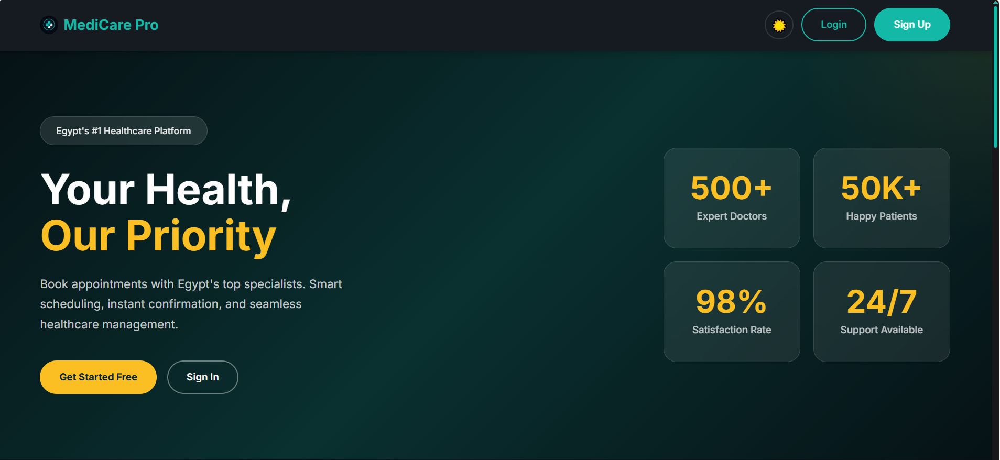
</p>

<p align="center">
<b>Landing Page</b><br>
The application's public landing page introducing MediCare Pro, its services, and the appointment booking experience.
</p>

---

## 🔐 Authentication

| Login | Register |
|:------:|:--------:|
| 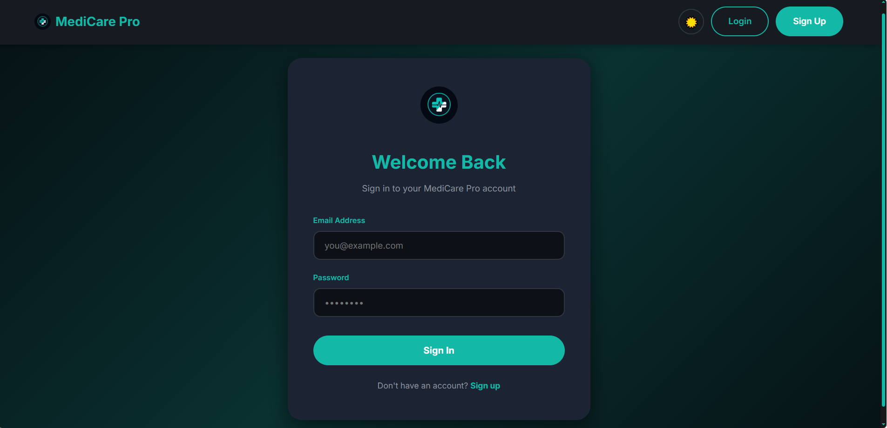 | 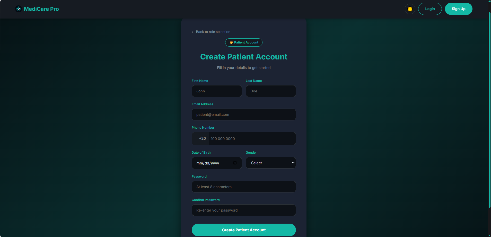 |
| Secure Login | Patient Registration |

---

## 👤 Patient Experience

| Home | Find Doctors |
|:----:|:------------:|
| 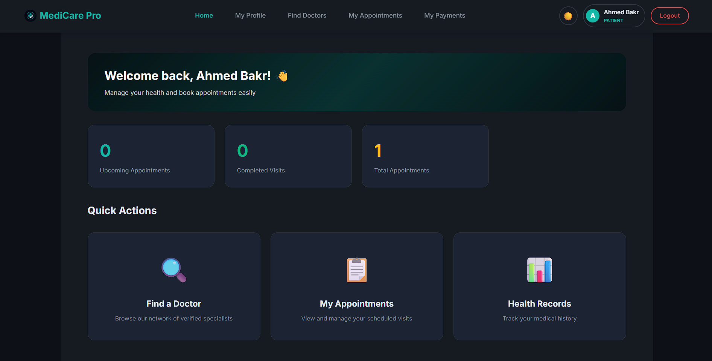 | 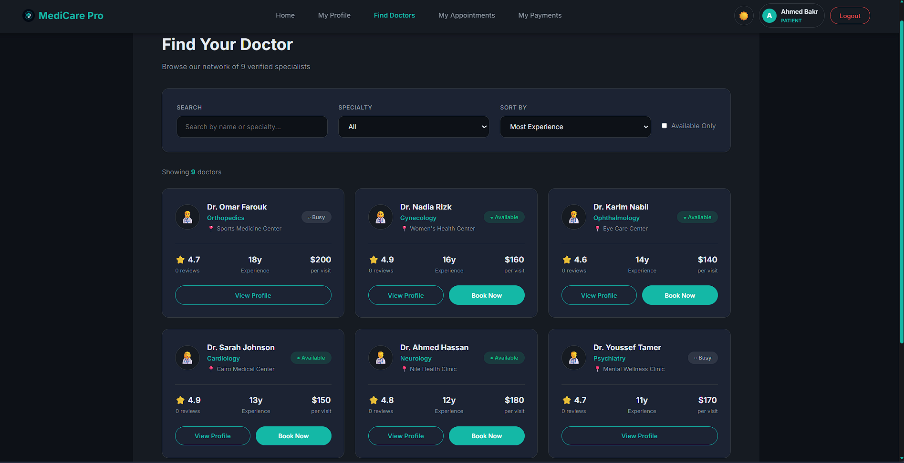 |

| Book Appointment | Stripe Payment |
|:----------------:|:--------------:|
| 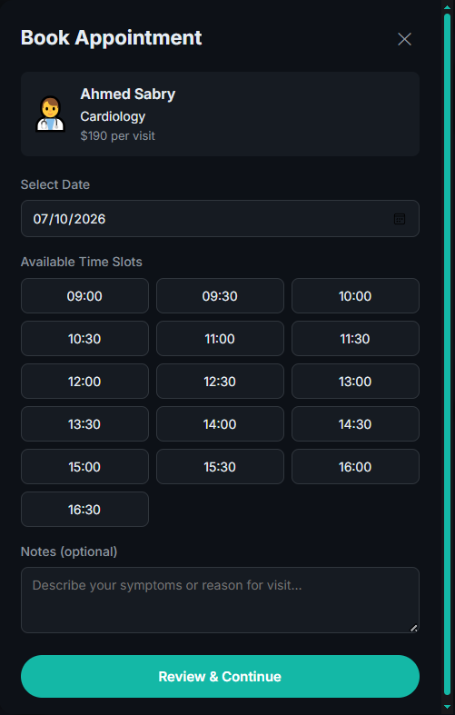 | 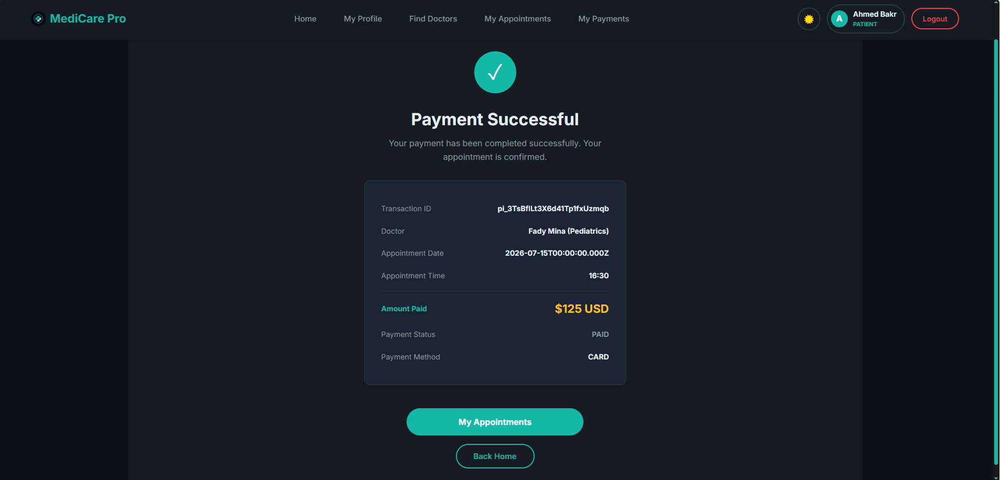 |

| My Appointments | My Payments |
|:---------------:|:-----------:|
| 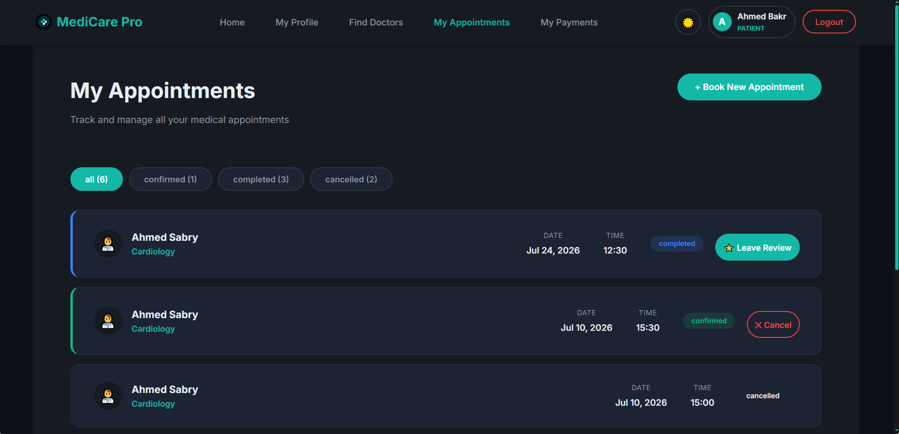 | 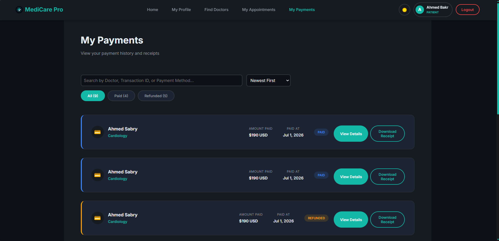 |

| Reviews | Profile |
|:-------:|:-------:|
| 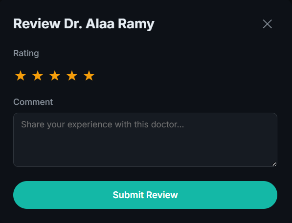 | 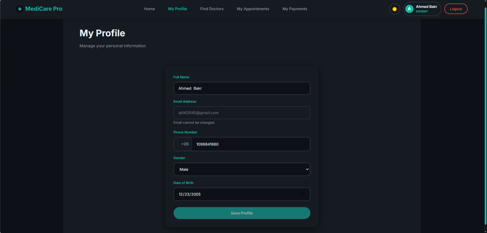 |

---

## 🩺 Doctor Experience

| Dashboard | Appointment Requests |
|:---------:|:--------------------:|
| 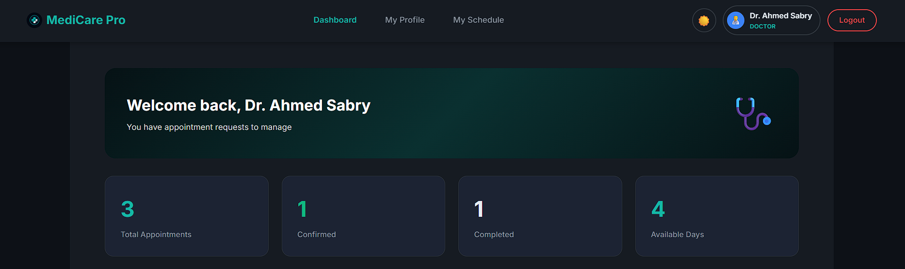 | 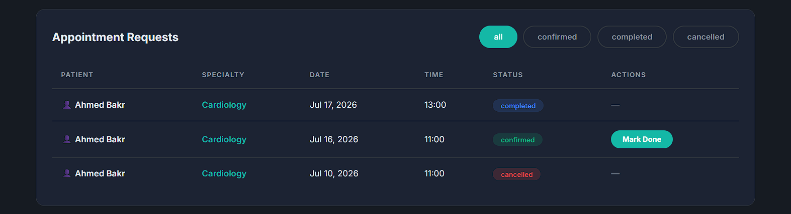 |

| Weekly Schedule | Profile |
|:---------------:|:-------:|
| 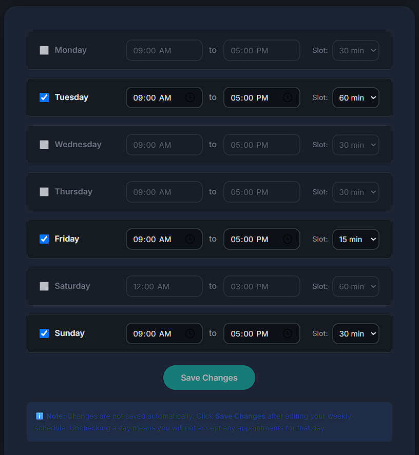 | 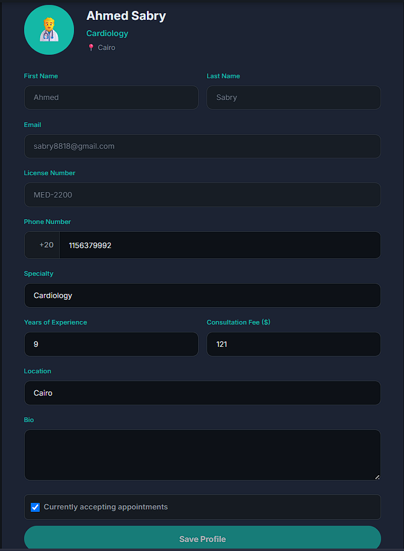 |

---

## 👨‍💼 Admin Experience

| Dashboard | Users |
|:---------:|:-----:|
| 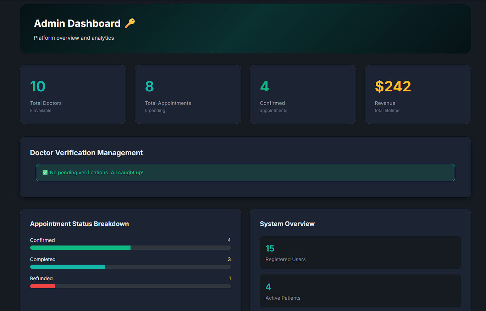 | 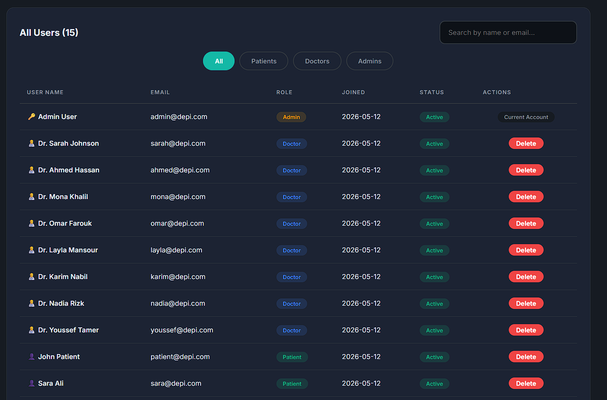 |

| Doctors | Appointments |
|:--------:|:------------:|
| 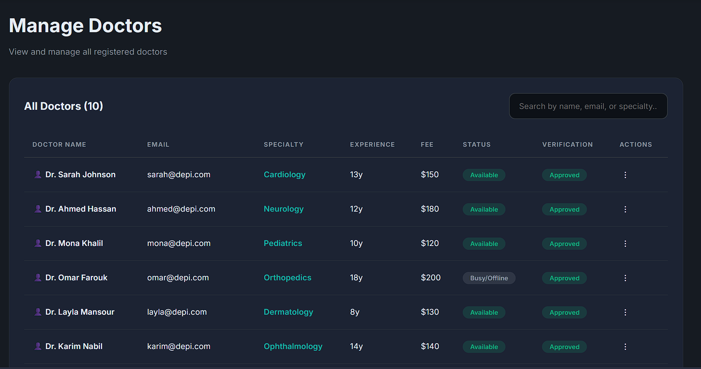 | 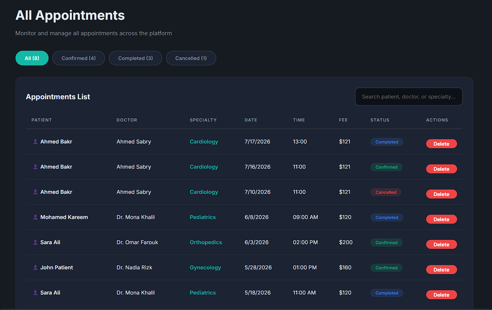 |

| Analytics | Transactions |
|:---------:|:------------:|
| 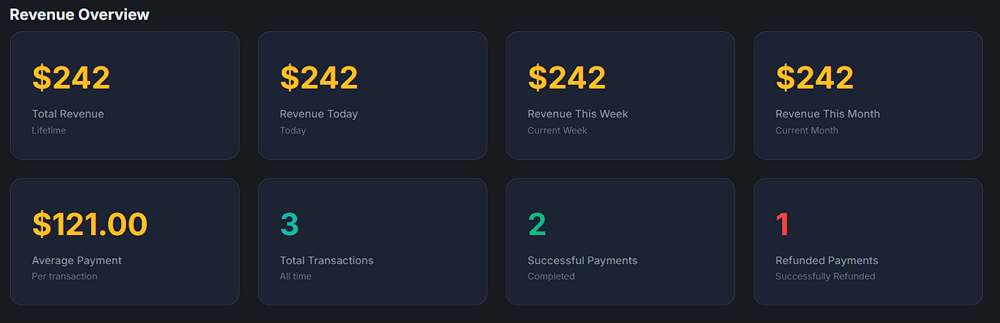 | 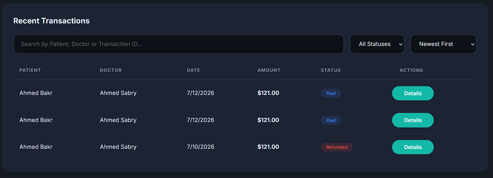 |

---

# 🎥 Project Demonstration

<p align="center">

<a href="YOUR_YOUTUBE_LINK">


</a>

</p>

The demo video walks through the complete healthcare workflow:

- Landing Page
- Registration
- Login
- Find Doctor
- Appointment Booking
- Stripe Payment
- Doctor Dashboard
- Appointment Completion
- Admin Analytics
- Revenue Dashboard

---

# 🚀 Getting Started

Clone the repository

```bash
git clone https://github.com/A200B5/smart-healthcare-system.git
```

Navigate to the project

```bash
cd smart-healthcare-system
```

---

# ⚙ Backend Setup

```bash
cd backend

npm install

npm run dev
```

Backend runs on:

```
http://localhost:5000
```

---

# 💻 Frontend Setup

```bash
cd frontend

npm install

npm run dev
```

Frontend runs on:

```
http://localhost:5173
```

---

# ⚙ Environment Variables

Backend

```env
PORT=

JWT_SECRET=

DB_SERVER=

DB_DATABASE=

DB_USER=

DB_PASSWORD=

STRIPE_SECRET_KEY=

STRIPE_WEBHOOK_SECRET=
```

---

Frontend

```env
VITE_API_URL=http://localhost:5000/api
```

---

# 📦 Required Software

- Node.js 20+
- SQL Server
- Git
- npm
- Visual Studio Code

---

# 🧪 Testing Checklist

Before running the project, ensure:

- SQL Server is running
- Database is restored
- Environment variables are configured
- Stripe keys are valid
- Backend is running
- Frontend is running

---

# 📱 Responsive Design

The application is fully responsive and optimized for:

- Desktop
- Laptop
- Tablet
- Mobile Devices

The responsive layout ensures consistent user experience across all supported screen sizes.

---

# 👥 Team Contributions

MediCare Pro was developed collaboratively by a four-member team, with each member responsible for a specific domain of the system.

| Team Member | Responsibilities |
|-------------|------------------|
| **Ahmed Bakr** | Led the Patient & Doctor experience, including dashboards, appointment booking workflow, profile management, UI integration, and overall frontend user experience. |
| **Ahmed Hany** | Designed and implemented the backend architecture, RESTful APIs, SQL Server database schema, business logic, and stored procedures. |
| **Ibrahim Mohamed** | Developed the Admin platform, analytics dashboard, revenue tracking, Stripe payment integration, refund workflow, and administrative operations. |
| **Ahmed Sabry** | Built reusable frontend components, UI/UX implementation, responsive layouts, authentication interfaces, and quality assurance. |

---

# 🚧 Technical Challenges

Throughout the development process, several real-world engineering challenges were encountered and solved.

### 🔐 Secure Authentication

Implemented secure authentication using JSON Web Tokens (JWT) with protected routes and role-based authorization.

---

### 💳 Online Payment Integration

Integrated Stripe Checkout for secure online payments while maintaining a seamless booking experience.

---

### ♻️ Automatic Refund Workflow

Designed a reliable refund workflow that synchronizes Stripe refunds with SQL Server payment records and prevents inconsistent payment states.

---

### 📅 Appointment Scheduling

Implemented appointment conflict prevention to ensure:

- A doctor cannot be booked twice for the same time slot.
- A patient cannot have overlapping appointments.
- Booked slots become unavailable immediately.

---

### 📊 Analytics & Reporting

Built an analytics dashboard providing insights into:

- Revenue
- Appointments
- Doctors
- Patients
- Payments

---

### 🏗 Scalable Architecture

Separated the application into reusable frontend components and layered backend services to improve maintainability and scalability.

---

# 🔮 Future Enhancements

The current version of MediCare Pro establishes a strong foundation for future development.

Planned enhancements include:

- 💬 Doctor–Patient Chat
- 🎥 Video Consultation
- 🤖 AI Doctor Matching
- 📂 Electronic Medical Records
- 📱 Native Mobile Applications (iOS & Android)
- 📧 Email Notifications
- 📲 SMS Appointment Reminders

---

# 📈 Project Impact

MediCare Pro demonstrates the implementation of a production-oriented healthcare platform by combining modern frontend technologies, scalable backend architecture, secure payment processing, and role-based workflows.

The project showcases practical software engineering concepts including:

- Full-Stack Web Development
- RESTful API Design
- SQL Server Database Design
- Authentication & Authorization
- Online Payment Processing
- Dashboard & Analytics
- Responsive User Interfaces
- Clean Software Architecture

---

# 🤝 Contributing

This repository represents a graduation project developed by the MediCare Pro team.

External contributions are not currently accepted.

However, feedback, suggestions, and constructive discussions are always welcome.

---

# 📄 License

**All Rights Reserved**

Copyright © 2026 MediCare Pro Team.

This repository and all associated source code, documentation, UI designs, and assets are protected.

No part of this project may be copied, redistributed, modified, or reused without explicit written permission from the project authors.

---

# 🙏 Acknowledgements

Special thanks to:

- Digital Egypt Pioneers Initiative (DEPI)
- Project Supervisors
- Mentors
- Teaching Assistants
- All testers and contributors who supported the project throughout its development.

---

# ⭐ Support the Project

If you found this project interesting or helpful, please consider giving the repository a ⭐ on GitHub.

Your support motivates us to continue improving the project and developing new features.

---

# 📬 Contact

For questions or collaboration opportunities, feel free to reach out through GitHub or LinkedIn.

- **GitHub:** https://github.com/A200B5
- **Project Repository:** https://github.com/A200B5/smart-healthcare-system

---

<p align="center">

### ❤️ Built with passion by the MediCare Pro Team

**Digital Egypt Pioneers Initiative (DEPI) — Graduation Project 2026**

</p>
